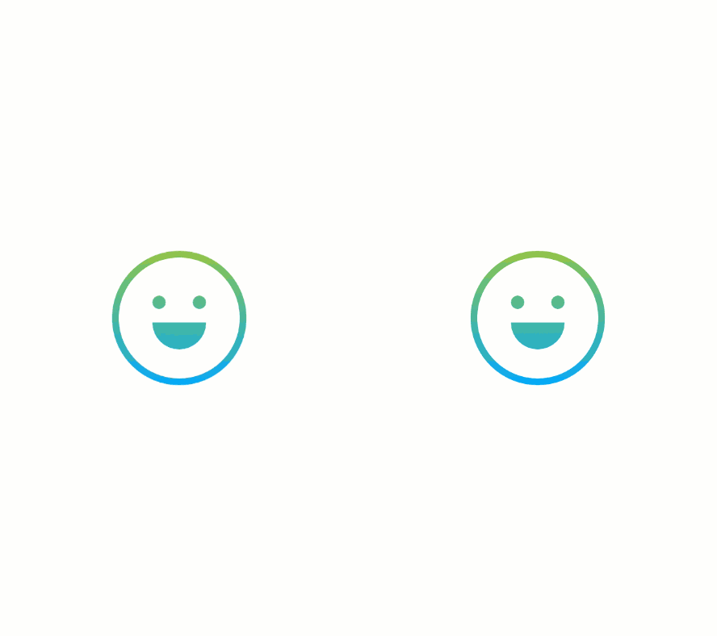

# Sentiments

Sentiments is an iOS app written in Swift that analyzes text for positive or negative sentiment. Positive sentiment is highlighted in green and negative sentiment is highlighted in red. The color of the interface reflects the aggregate sentiment of the analyzed text.

## Usage

1. Open `Sentiment-Analysis.xcworkspace`.
2. Replace "YOUR_API_KEY" with your API key from [HPE Haven OnDemand](https://www.havenondemand.com) in [`AppConfig.swift`](https://github.com/kyleweiner/Sentiments/tree/master/Sentiment-Analysis/Constants/AppConfig.swift).
3. Enter text in the text field and press the check button.

## Author

Sentiments was written and designed by Kyle Weiner. It uses [Alamofire](https://github.com/Alamofire/Alamofire), [SwiftyJSON](https://github.com/SwiftyJSON/SwiftyJSON) and [HPE Haven OnDemand](https://dev.havenondemand.com/apis/analyzesentiment#overview)'s Sentiment Analysis API.

## License

Copyright (c) 2016 Kyle Weiner. See the LICENSE file for details.